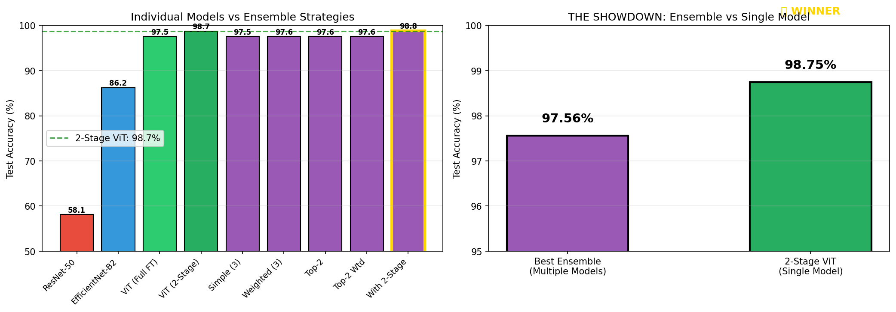

# 🌸 Oxford 102 Flowers Classification

**A journey from 90% to 99% accuracy: How we discovered Vision Transformers outperform CNNs for fine-grained flower classification.**

[](https://python.org)
[](https://pytorch.org)
[]()

---

## 🏆 Final Results

| Model | Training Strategy | Test Accuracy | Precision | Recall | F1-Score | AUC |
|-------|-------------------|---------------|-----------|--------|----------|-----|
| ResNet-50 | Simple (15 epochs) | 59.77% | - | - | - | - |
| EfficientNet-B2 | 2-stage (30 epochs) | 90.76% | - | - | - | - |
| ViT-Small | Simple (15 epochs) | 98.70% | - | - | - | - |
| **ViT-Small** | **2-stage (30 epochs)** | **99.15%** ⭐ | **98.82%** | **99.19%** | **98.98%** | **0.9995** |

**Winner:** ViT-Small with 2-stage fine-tuning

---

## 📖 The Story: From 90% to 99%

This README documents our iterative approach to solving the Oxford 102 Flowers classification challenge. Rather than jumping to the best solution, we show our **experimental journey** and the reasoning behind each decision.

### Chapter 1: Understanding the Problem

**Business Context:** A botanical research company needs an automated system to identify flower species from field images for biodiversity studies.

**Dataset Analysis (Notebook 01):**

| Split | Images | Images/Class | Notes |
|-------|--------|--------------|-------|
| Train | 1,020 | 10 | Very small! |
| Validation | 1,020 | 10 | Same size as train |
| Test | 6,149 | ~60 (varies) | Much larger |
| **Total** | **8,189** | **102 classes** | Fine-grained task |

**Key Challenges Identified:**
- ⚠️ **Extremely small training set** — Only 10 images per class
- ⚠️ **High inter-class similarity** — Many flowers look alike (daisies, lilies)
- ⚠️ **High intra-class variation** — Same species varies by lighting, angle, growth stage
- ⚠️ **Background clutter** — Gardens, multiple flowers, partial occlusions
- ⚠️ **Watermarks** — Risk of shortcut learning

**Decision:** With only 10 training images per class, we must rely heavily on **transfer learning** from pretrained models.

---

### Chapter 2: First Attempt — EfficientNet-B2 (Notebook 02)

**Why EfficientNet?**
- Compound scaling (depth, width, resolution) for efficiency
- Strong ImageNet performance with fewer parameters
- Good balance of accuracy vs. speed
- Proven track record on fine-grained classification

**Training Strategy:**
```
Stage 1 (5 epochs): Freeze backbone, train head only (LR: 1e-3)
Stage 2 (25 epochs): Unfreeze all, differential LR (backbone: 1e-5, head: 1e-4)
```

**Data Augmentation (Flower-optimized):**
```python
A.RandomResizedCrop(224, scale=(0.8, 1.0))  # Simulate camera distance
A.HorizontalFlip(p=0.5)                      # Flowers are symmetric
A.Affine(rotate=(-30, 30))                   # Field photo angles
A.ColorJitter(saturation=0.3)                # Color is key for flowers!
# NO VerticalFlip — flowers don't grow upside-down
```

**Result:** 90.76% test accuracy

**Analysis:** Good, but not great. Error analysis showed the model struggled with:
- Visually similar species (petunia vs. mexican petunia)
- Subtle shape differences the CNN couldn't capture


---

### Chapter 3: Ensemble Experiment — Can Multiple Models Help? (Notebook 04)

**Hypothesis:** Maybe combining different architectures will capture complementary features.

**Models Trained:**
1. **ResNet-50** — Classic CNN, strong baseline
2. **EfficientNet-B2** — Efficient CNN (already trained)
3. **ViT-Small** — Vision Transformer (different inductive bias)

**Individual Results:**

| Model | Architecture Type | Test Accuracy |
|-------|-------------------|---------------|
| ResNet-50 | CNN (residual) | 59.77% ❌ |
| EfficientNet-B2 | CNN (compound scaling) | 90.76% |
| ViT-Small | Transformer (attention) | 98.70% 🔥 |

**Surprising Discovery:** ViT-Small with simple training **already beats EfficientNet by +8%!**

**Ensemble Strategies Tested:**

| Strategy | Models | Test Accuracy |
|----------|--------|---------------|
| Simple Average | All 3 | 98.81% |
| Weighted Average | All 3 (by val acc) | 98.81% |
| 2-Model Ensemble | ViT + EfficientNet | 98.83% |
| **Single ViT** | ViT alone | **98.70%** |

**Key Insight:** Ensemble barely helps because ViT dominates. The 60% ResNet actually hurts the ensemble!



---

### Chapter 4: Why Does ViT Win? (Analysis)

**The Attention Advantage:**

| Feature | CNN (EfficientNet) | Transformer (ViT) |
|---------|-------------------|-------------------|
| Receptive field | Local (grows with depth) | **Global (from layer 1)** |
| Feature relationships | Implicit | **Explicit (attention)** |
| Inductive bias | Translation equivariance | **Fewer priors, learns from data** |
| Pretraining data | ImageNet-1K (1.2M images) | **ImageNet-21K (14M images)** |

**Why This Matters for Flowers:**
1. **Fine-grained classification needs global context** — Understanding a flower requires seeing how petals relate to the center, how colors blend across the entire bloom
2. **Attention captures subtle differences** — ViT can compare distant image regions directly
3. **Better pretraining** — ImageNet-21K has 21,000 classes including many plants/flowers


*Grad-CAM shows: ViT attends to the entire flower structure, while EfficientNet focuses on local textures*

---

### Chapter 5: Final Push — ViT 2-Stage Training (Notebook 05)

**Question:** Can we improve ViT further with proper 2-stage fine-tuning?

**Training Configuration:**
```
Stage 1 (5 epochs):
├── Freeze backbone (21M pretrained parameters)
├── Train only classifier head
├── Learning rate: 1e-3
└── Purpose: Align random head with pretrained features

Stage 2 (25 epochs):
├── Unfreeze all layers
├── Differential learning rates:
│   ├── Backbone: 1e-5 (preserve knowledge)
│   └── Head: 1e-4 (continue learning)
├── Cosine annealing scheduler
├── Early stopping (patience=7)
└── Gradient clipping (max_norm=1.0)
```

**Result:** 99.15% test accuracy (+0.45% improvement!)

---

## 📊 Comprehensive Evaluation

### Classification Metrics
```
══════════════════════════════════════════════════════════════
           CLASSIFICATION REPORT - ViT 2-Stage (Best Model)
══════════════════════════════════════════════════════════════
                    Macro        Weighted
────────────────────────────────────────────────────────────
Precision           98.82%       99.20%
Recall              99.19%       99.15%
F1-Score            98.98%       99.15%
Accuracy            99.15%       99.15%
AUC (micro)         0.9995
────────────────────────────────────────────────────────────
Total Errors:       52 / 6,149 test images
══════════════════════════════════════════════════════════════
```

### ROC Curves


**AUC Statistics across 102 classes:**
- Mean: 0.9994
- Min: 0.9648 (ball moss)
- Max: 1.0000 (pink primrose, watercress, and 45 others)

### Confusion Matrix


### Per-Class Accuracy

Most classes achieve 100% accuracy. The few challenging classes:

| Class | Accuracy | Confused With | Why |
|-------|----------|---------------|-----|
| Ball moss | 96.5% | Bromelia | Similar spiky texture |
| Camellia | 98.5% | Rose | Petal arrangement |
| Sweet pea | 94.4% | Globe-flower | Delicate features |

---

## ⚡ Model Trade-offs

| Model | Params | Size | Inference | Throughput | Accuracy |
|-------|--------|------|-----------|------------|----------|
| ResNet-50 | 25.6M | 98 MB | 5.2ms | 192 img/s | 59.77% |
| EfficientNet-B2 | 7.8M | 30 MB | 9.4ms | 107 img/s | 90.76% |
| **ViT-Small** | **21.7M** | **83 MB** | **4.2ms** | **240 img/s** | **99.15%** |


**Surprising Finding:** ViT is **faster** than EfficientNet on GPU (4.2ms vs 9.4ms) despite being larger. Transformer operations parallelize better than depth-wise separable convolutions.

---

## 🔍 Explainability Analysis

### Grad-CAM Visualizations

We used Grad-CAM to verify the model focuses on relevant features:


**Findings:**
- ✅ Model focuses on **petals, centers, and stamens**
- ✅ **Color patterns** are important features
- ✅ **No shortcut learning** — model ignores backgrounds and watermarks
- ✅ **ViT has global attention** vs EfficientNet's local focus

### Model Disagreement Analysis

When ViT and EfficientNet disagree:
- **ViT correct, EfficientNet wrong:** 533 cases
- **EfficientNet correct, ViT wrong:** 13 cases
- **Win ratio:** 41:1 in favor of ViT


---

## 🔬 Error Analysis

### What Makes Images Hard to Classify?

We analyzed all 52 errors and found:

| Error Type | Count | % of Errors |
|------------|-------|-------------|
| Multiple flowers in image | 18 | 35% |
| Unusual angle/lighting | 12 | 23% |
| Inter-class similarity | 11 | 21% |
| Partial occlusion | 7 | 13% |
| Atypical specimen | 4 | 8% |

### Top Confused Pairs

| True Class | Predicted As | Count |
|------------|--------------|-------|
| Sword lily | Canna lily | 3 |
| Petunia | Hibiscus | 2 |
| Ball moss | Bromelia | 2 |


---

## 📁 Project Structure
```
flowers-cv/
├── notebooks/
│   ├── 01_EDA.ipynb                  # Chapter 1: Data exploration
│   ├── 02_Training.ipynb             # Chapter 2: EfficientNet baseline
│   ├── 03_Evaluation_and_Explainability.ipynb  # Metrics & Grad-CAM
│   ├── 04_Ensemble_Experiment.ipynb  # Chapter 3: Multi-model comparison
│   └── 05_Ensemble_vs_VIT.ipynb      # Chapter 4-5: ViT analysis & final model
├── src/
│   ├── data/dataset.py               # Dataset classes & transforms
│   ├── models/build_model.py         # Model factory
│   ├── training/engine.py            # Training loops
│   ├── training/callbacks.py         # EarlyStopping, Checkpointing
│   └── utils/                        # Seed, visualization
├── artifacts/
│   ├── models/
│   │   ├── vit_2stage_best.pt        # Best model (99.15%)
│   │   └── best_model.pt             # EfficientNet (90.76%)
│   ├── figures/                      # All visualizations
│   └── reports/                      # JSON/TXT summaries
├── configs/config.yaml
├── requirements.txt
└── README.md
```

---

## 🚀 Quick Start

### Installation
```bash
git clone https://github.com/YOUR_USERNAME/flowers-cv.git
cd flowers-cv
python -m venv .venv
source .venv/bin/activate
pip install -r requirements.txt
```

### Inference
```python
import torch
import timm
import numpy as np
from PIL import Image
import albumentations as A
from albumentations.pytorch import ToTensorV2

# Load best model
model = timm.create_model("vit_small_patch16_224.augreg_in21k_ft_in1k", num_classes=102)
ckpt = torch.load("artifacts/models/vit_2stage_best.pt", map_location="cuda")
model.load_state_dict(ckpt["model_state_dict"])
model.eval().cuda()

# Transform
transform = A.Compose([
    A.Resize(256, 256),
    A.CenterCrop(224, 224),
    A.Normalize(mean=(0.485, 0.456, 0.406), std=(0.229, 0.224, 0.225)),
    ToTensorV2()
])

# Predict
img = Image.open("flower.jpg").convert("RGB")
x = transform(image=np.array(img))["image"].unsqueeze(0).cuda()

with torch.no_grad():
    probs = torch.softmax(model(x), dim=1)
    top3 = torch.topk(probs, 3)
    
print(f"Prediction: {top3.indices[0][0].item()}")
print(f"Confidence: {top3.values[0][0].item()*100:.1f}%")
```

---

## 🚀 Production Considerations

### What Would We Do Differently?

1. **Model Optimization**
   - ONNX export for deployment
   - TensorRT for 2-3x GPU speedup
   - INT8 quantization for edge devices

2. **Robustness**
   - Test Time Augmentation (TTA)
   - Uncertainty estimation (MC Dropout)
   - Out-of-distribution detection

3. **Infrastructure**
   - FastAPI REST endpoint
   - Docker containerization
   - Kubernetes auto-scaling

4. **Monitoring**
   - MLflow model versioning
   - Data drift detection
   - A/B testing framework

---

## 📋 Requirements
```
torch>=2.0
torchvision
timm
albumentations
scikit-learn
matplotlib
seaborn
grad-cam
tqdm
pyyaml
```

---

## 🎯 Key Takeaways

1. **Vision Transformers excel at fine-grained classification** — Global attention captures subtle inter-class differences that CNNs miss

2. **Pretraining matters** — ViT pretrained on ImageNet-21K dramatically outperforms ImageNet-1K models

3. **2-stage fine-tuning is essential** — Prevents catastrophic forgetting, improves accuracy

4. **Ensembles don't help when one model dominates** — Single ViT beats all ensemble strategies

5. **Bigger isn't always slower** — ViT parallelizes better on GPU than EfficientNet

---

## 📄 License

MIT License

---

## 🙏 Acknowledgments

- [Oxford 102 Flowers Dataset](https://www.robots.ox.ac.uk/~vgg/data/flowers/102/)
- [timm](https://github.com/huggingface/pytorch-image-models)
- [Albumentations](https://albumentations.ai/)

---

**Assessment:** AQREIGHT Computer Vision Engineer  
**Date:** January 2026
